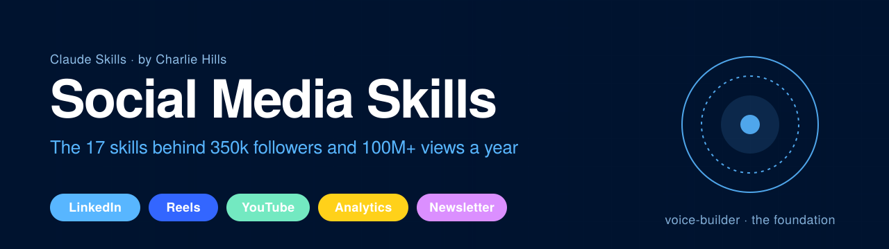

<p align="center">
  
</p>

# Social Media Skills for AI Agents

17 standalone public skills for **Codex and Claude**: user voice, LinkedIn writing, research, analytics, Reel scripting and Gemini image prompts. This repository is a public toolkit, not the complete private LinkedIn AI OS, its Figma production pipeline, or the maintainer's accounts and configuration.

Built by [Charlie Hills](https://charliehills.substack.com). Subscribe to the [MarTech AI newsletter](https://charliehills.substack.com) for weekly breakdowns of how this system works in practice.

**Contributions welcome.** Found a way to improve a skill? [Open a PR](https://github.com/charlie947/social-media-skills/pulls). Run into a problem? [Open an issue](https://github.com/charlie947/social-media-skills/issues).

## What are Skills?

Skills are markdown files that give AI agents specialised knowledge and workflows for specific tasks. When you install these in your project, the assistant can recognise when you're working on a social media task and applies the right patterns, voice rules, and platform constraints.

## How Skills Work Together

Use `voice-builder` to create `about-me.md` and `voice.md` in your selected project. These skills read that context before personalised work. Existing author-approved files work too. Missing or starter profiles must be resolved before claiming a voice match. Source-only research and analytics can proceed without a personal voice profile. `newsletter-voice` is optional for newsletter work.

```
                    ┌──────────────────────────────────────┐
                    │           voice-builder              │
                    │   about-me.md + voice.md             │
                    │   (read by every skill below)        │
                    └──────────────────┬───────────────────┘
                                       │
                    ┌──────────────────▼───────────────────┐
                    │         newsletter-voice             │
                    │   newsletter-voice.md                │
                    │   (optional newsletter context)     │
                    └──────────────────┬───────────────────┘
                                       │
     ┌────────────┬────────────┬───────┴───────┬────────────┬────────────┐
     ▼            ▼            ▼               ▼            ▼            ▼
┌──────────┐ ┌──────────┐ ┌──────────┐ ┌──────────────┐ ┌──────────┐ ┌──────────┐
│ Profile  │ │LinkedIn  │ │ Video    │ │ Analytics &  │ │Community │ │Standalone│
│          │ │ posts    │ │          │ │ Scoring      │ │          │ │          │
├──────────┤ ├──────────┤ ├──────────┤ ├──────────────┤ ├──────────┤ ├──────────┤
│profile-  │ │post-     │ │reels-    │ │post-scorer   │ │pinned-   │ │hook-gen  │
│ optimizer│ │ writer   │ │ scripting│ │              │ │ comment  │ │content-  │
│          │ │graphic-  │ │youtube-  │ │analytics-    │ │          │ │ matrix   │
│          │ │ designer │ │ thumbnail│ │ dashboard    │ │          │ │niche-    │
│          │ │          │ │          │ │              │ │          │ │ research │
│          │ │post-form │ │          │ │              │ │          │ │gemini-*  │
│          │ │          │ │          │ │              │ │          │ │quote-post│
└──────────┘ └──────────┘ └──────────┘ └──────────────┘ └──────────┘ └──────────┘
```

See each skill's `SKILL.md` for trigger phrases, inputs, and dependencies.

## Available Skills

<!-- SKILLS:START -->
| Skill | Description |
|---|---|
| [voice-builder](skills/voice-builder/) | Build `about-me.md` and `voice.md` from an interview plus 3 to 5 writing samples. The foundation every other skill reads. |
| [newsletter-voice](skills/newsletter-voice/) | Add newsletter-specific writing instructions on top of voice-builder. Produces `newsletter-voice.md`. |
| [profile-optimizer](skills/profile-optimizer/) | Rebuild a LinkedIn profile for conversions. Headline, about, experience, featured section, plus 4 image generation prompts. |
| [post-writer](skills/post-writer/) | Draft LinkedIn posts in your voice using the voice files. |
| [graphic-designer](skills/graphic-designer/) | Create HTML/CSS plus an inspected PNG when rendering is available, or a Gemini image prompt. |
| [post-scorer](skills/post-scorer/) | Review against your supplied history or authorised Apify results, with an editorial-only fallback. |
| [reels-scripting](skills/reels-scripting/) | Analyse a reference Reel via Apify + Gemini 2.5 Flash, or use supplied material. Draft and review a script in your voice. |
| [youtube-thumbnail](skills/youtube-thumbnail/) | Turn a video title into a branded YouTube thumbnail prompt for Gemini. |
| [pinned-comment](skills/pinned-comment/) | Meme-style pinned comments with a matching image generation prompt. |
| [hook-generator](skills/hook-generator/) | 6 concise hook angles using supplied facts and genuine author experience. |
| [post-formatter](skills/post-formatter/) | Topic to ready-to-publish post using PAS, AIDA, BAB, STAR, or SLAY. |
| [content-matrix](skills/content-matrix/) | Pair your 3 to 5 pillars with 8 formats for 24 to 40 post ideas. |
| [niche-research](skills/niche-research/) | Find up to 20 dated stories from the last 7 days with available web/browser tools and explicit source coverage. |
| [gemini-infographic](skills/gemini-infographic/) | Create a whiteboard infographic brief and Gemini prompt. |
| [gemini-carousel](skills/gemini-carousel/) | Create a carousel brief and per-slide Gemini prompts with an approval gate. |
| [quote-post](skills/quote-post/) | Draft original quotes and a Gemini prompt for the selected reference style. |
| [analytics-dashboard](skills/analytics-dashboard/) | LinkedIn Analytics export to interactive React dashboard plus 5 data-backed recommendations. |
<!-- SKILLS:END -->

## Installation

### Codex: use the existing skill installer

In Codex, ask:

> Use skill-installer to install voice-builder and post-writer from charlie947/social-media-skills, paths skills/voice-builder and skills/post-writer.

Install any of the 17 named folders the same way. The existing installer refuses an existing destination. Continue in a fresh task/turn, confirm the skill appears in the available skills and check its loaded path before use. Installation does not run onboarding or transfer accounts.

### Codex: project-local copy

From your chosen project's root, clone this repository into a new `social-media-skills` folder, then copy each skill into Codex's discovery path. If that clone folder already exists, inspect it and reuse it rather than cloning over it.

```bash
git clone https://github.com/charlie947/social-media-skills.git
```

<!-- CODEX-COPY:START -->
```bash
test -d social-media-skills/skills || { printf 'Missing source skills folder\n'; exit 1; }
mkdir -p .agents/skills || exit 1
for skill in social-media-skills/skills/*; do
  [ -f "$skill/SKILL.md" ] || continue
  name="$(basename "$skill")"
  destination=".agents/skills/$name"
  if [ -e "$destination" ] || [ -L "$destination" ]; then
    printf 'Preserved existing skill: %s\n' "$destination"
  else
    cp -R "$skill" "$destination" || exit 1
  fi
done
```
<!-- CODEX-COPY:END -->

Open a fresh Codex task in this project and confirm the intended skills are loaded from `.agents/skills/<name>/SKILL.md`. A clone or submodule at `.agents/social-media-skills` alone is not the documented discovery route. Avoid installing a second conflicting version globally and locally.

### Claude Code: existing plugin marketplace

In Claude Code:

```text
/plugin marketplace add charlie947/social-media-skills
/plugin install social-media-skills
```

Use Claude Code's existing plugin update mechanism for this installation route.

### Claude Desktop: individual skill upload

Zip a whole skill folder, including its `references/` when present, and upload via Customise skills. For example, from `social-media-skills/skills`:

```bash
zip -r voice-builder.skill voice-builder
```

These uploads contain the selected public skill only. Install another skill when a workflow names it, or ask the assistant to perform that next step directly with the supplied context.

### Updating an installed copy

Update the source checkout through normal Git (`git pull --ff-only` after inspecting local changes). Copied or uploaded skills do not refresh when the source checkout changes. Inspect the actual loaded path and compare that installed folder with the new source. Preserve customised files, merge the relevant changes, then reload in a fresh task. The copy loop above deliberately preserves existing folders, including symlinks; it is not an updater. If the loaded route is an existing symlink, inspect its resolved source and update that source through its existing Git route. Never replace a customised installation blindly.

## Usage

For personalised writing, run `voice-builder` first or supply your existing author profile. Keep those files in the content project, not inside an installed skill folder.

Once installed, ask Codex or Claude to help with content tasks and it will pick the right skill:

```
"Build my voice" → voice-builder
"Write me a post about AI agents" → post-writer
"Score this draft against my history" → post-scorer
"Make me a carousel from this" → gemini-carousel
"What should I post this week" → niche-research or content-matrix
"Turn this outlier Reel into a script" → reels-scripting
"I need a thumbnail for 'How I fired my team'" → youtube-thumbnail
"Write me a pinned comment" → pinned-comment
```

## Skill Categories

### Voice foundation
- `voice-builder` — interview + sample analysis, writes about-me.md and voice.md
- `newsletter-voice` — newsletter-specific writing rules on top of voice-builder

### LinkedIn
- `profile-optimizer` — full profile rebuild
- `post-writer` — drafts in your voice
- `graphic-designer` — HTML/CSS export or Gemini prompt, following the chosen route
- `post-formatter` — topic to post via named framework (PAS, AIDA, BAB, STAR, SLAY)
- `hook-generator` — 6 hook variations per topic
- `post-scorer` — scores drafts against your post history
- `content-matrix` — pillars x formats ideation
- `niche-research` — 7-day research with available source tools
- `gemini-infographic` — whiteboard style for Gemini
- `gemini-carousel` — slide-by-slide carousel
- `quote-post` — two-step quote workflow

### Instagram Reels
- `reels-scripting` — Apify + Gemini 2.5 Flash reference analysis, newsletter-aligned script

### YouTube
- `youtube-thumbnail` — title to Gemini thumbnail prompt

### Community
- `pinned-comment` — meme-style pin + image prompt

### Analytics
- `analytics-dashboard` — LinkedIn export to dashboard + 5 recommendations

## Capabilities and completion states

Only connect integrations required for the selected workflow. Credentials belong in your own account or local environment, never in this repository or chat output. Existing connections must be preserved.

| Workflow | Required capability | If unavailable |
|---|---|---|
| Voice, posts, hooks, formatting, matrix | Supplied context and writing samples for personalised work | Ask for missing facts; never use maintainer defaults |
| Niche research | Current source access via web search/browser | Supplied dated sources or a research-pending state; indexed results are not a full feed scan |
| Post scorer | Supplied post history; Apify is optional for a requested fetch | Editorial-only review, with history comparison unavailable |
| Reel URL analysis | Authorised Apify access (`APIFY_API_TOKEN`), Gemini 2.5 Flash access (`GOOGLE_AI_API_KEY`), Node and the named SDKs | Supplied video can skip Apify; supplied transcript permits a labelled transcript-based script |
| Gemini visual skills | No integration needed to draft prompts; Gemini image access needed to generate them | Prompt-ready only, with generation and image inspection pending |
| HTML graphic | Browser screenshot/export or an existing renderer | Editable HTML with render/inspection pending |
| Analytics | User's export and spreadsheet reader; React/Recharts runtime for interactive preview | Computed analysis and source, with interactive preview pending |

The image skills keep their Gemini prompt contracts. They do not include a Figma production system or animated carousel covers. `graphic-designer` also supports editable HTML. Actual rendered images must be opened and inspected at full and feed size before being called visually reviewed. For a carousel, inspect every slide. A prompt, connected account or passing static check is not that proof.

Codex performs drafting and review itself; Claude is optional in a Codex task. Scraping is limited to original post bodies and aggregate counts. Never collect comments/replies or enable comment collection indirectly. Saving a draft does not publish it.

## Contributing

PRs and issues welcome. See [CONTRIBUTING.md](CONTRIBUTING.md) for guidelines on adding or improving skills.

Run `bash validate-skills.sh` and `python3 tests/test-codex-portability.py` before submitting. Add `--codex` to the Python check on macOS/Linux to verify discovery through an installed Codex CLI in an empty temporary HOME, without credentials. These verify skill structure, installation preservation and instruction contracts. They do not certify a live provider, model performance, visual quality or a user’s activated environment.

## License

[MIT](LICENSE). Use these however you like. If they help you, a link back to the [newsletter](https://charliehills.substack.com) is appreciated.

— Charlie
